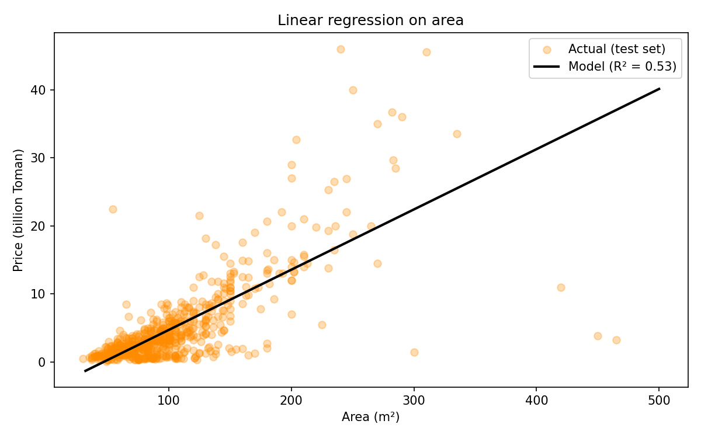
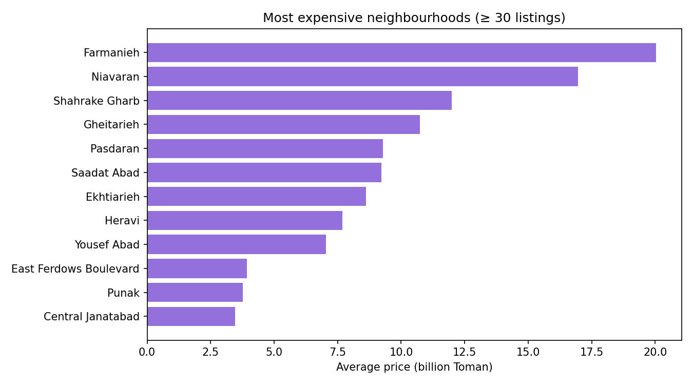

# Tehran House Prices

[](https://github.com/Amir-Seifi/tehran-house-prices/actions/workflows/ci.yml)

Exploratory analysis and linear regression models for apartment prices in Tehran,
built as a course project. One command cleans the data, writes the figures, trains
four models and prints a comparison.

## Results

Trained on 3,209 listings after cleaning, scored on a held-out 20% test set.
Prices are in billion Toman.

| Model         |    R² |   MAE |  RMSE |
| ------------- | ----: | ----: | ----: |
| Area only     | 0.528 | 2.300 | 4.238 |
| All features  | 0.738 | 1.687 | 3.160 |
| All + Ridge   | 0.736 | 1.689 | 3.172 |
| All + Lasso   | 0.717 | 1.756 | 3.281 |

Area is the strongest single predictor (correlation 0.75), but it explains only
about half the variance on its own. Adding the neighbourhood is what closes the
gap: location moves the predicted price further than any other feature.




## Install

Requires Python 3.10 or newer.

```bash
git clone https://github.com/Amir-Seifi/tehran-house-prices.git
cd tehran-house-prices
python -m venv .venv
source .venv/bin/activate
pip install -e ".[dev]"
```

## Usage

```bash
house-prices
```

The dataset is downloaded once and cached in `data/raw/`, so later runs work
offline. Figures and `metrics.json` are written to `reports/`. Both paths are
relative to the working directory, so run the command from the project root
(or point `--data-path` and `--output-dir` elsewhere).

Useful flags:

| Flag                | Meaning                                             |
| ------------------- | --------------------------------------------------- |
| `--data-path PATH`  | Use a local CSV instead of downloading               |
| `--refresh`         | Re-download even if a cached copy exists             |
| `--output-dir PATH` | Where figures and metrics go (default `reports/`)    |
| `--test-size FLOAT` | Held-out fraction (default `0.2`)                    |
| `--seed INT`        | Split seed (default `42`)                            |
| `--no-plots`        | Skip figures                                         |
| `--show`            | Open figures in a window as well as saving them      |
| `-v`                | Print progress logs                                  |
| `--version`         | Print the version and exit                           |

## Data

[`housePrice.csv`](https://raw.githubusercontent.com/SharifiZarchi/IntroAI/main/Session_04/TehranHouses/housePrice.csv)
from the SharifiZarchi *IntroAI* course: 3,479 listings with area, number of
rooms, parking / storage / elevator flags, neighbourhood and price.

Cleaning drops 270 rows in total:

| Step                              | Rows |
| --------------------------------- | ---: |
| Duplicate listings                |  208 |
| Missing values                    |   23 |
| Area outside 30–500 m²            |   23 |
| Price above the 99.5th percentile |   16 |

`Area` arrives as text with thousands separators (`"1,250"`), so it is parsed to
a number first. The area bounds remove data-entry errors — the raw file contains
"apartments" of over 10,000 m². The price cap removes a handful of luxury
listings that a linear model cannot represent anyway.

## Project layout

```
src/house_prices/
  config.py     constants and defaults
  data.py       download, cache, clean, correlations
  modeling.py   split, pipelines, training, coefficients
  plots.py      the five figures
  cli.py        argument parsing and the report
tests/          unit tests (synthetic data, no network)
```

Preprocessing lives inside the scikit-learn pipelines, so scaling and one-hot
encoding are fitted on the training fold only. Unseen neighbourhoods are handled
with `handle_unknown="ignore"`, and neighbourhoods with fewer than 10 listings are
pooled into one category so their coefficients stay meaningful.

Because every feature is standardised, the reported coefficients are directly
comparable: each is the price change in billion Toman per one standard deviation
of that feature.

## Development

```bash
pytest
ruff check .
```
